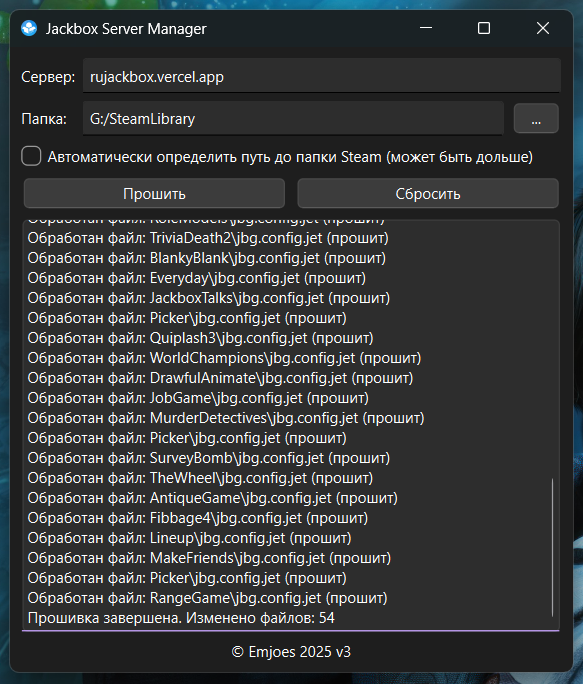

# Jackbox Server Manager

⚠️ **ВАЖНО:** Работает только для версий игр из `Steam` и только на системах `Windows`

## Описание

С недавнего времени многие русскоязычные игроки в `Jackbox` столкнулись с проблемами подключения к серверам. Эта программа предназначена для автоматического переключения всех игр `Jackbox` на вашем компьютере на альтернативный сервер. В случае необходимости предусмотрена возможность отмены изменений, чтобы вернуть всё в исходное состояние

## Использование

0. Если будет ругаться на вирусы

   - Нажмите под описанием кнопку `Подробнее`
   - Нажмите справа снизу кнопку `Выполнить в любом случае`

1. Введите один из следующих серверов в поле ввода

   - `rujackbox.vercel.app`
   - `jb-ecast.klucva.ru`

3. Нажмите кнопку `Прошить` и подождите

   - Программа выполнит изменения
   - Вы увидите отчет об измененных файлах, где в скобках будет указано, что файл был прошит

5. Запустите любую игру `Jackbox`

   - Вы можете запускать игры напрямую или через `Megapicker`
   - Если подключение к серверу не удалось, вернитесь к пункту 1 и выберите другой сервер

4. Если потребуется вернуть всё в исходное состояние

   - Нажмите кнопку `Сбросить`
   - Подождите завершения процесса

